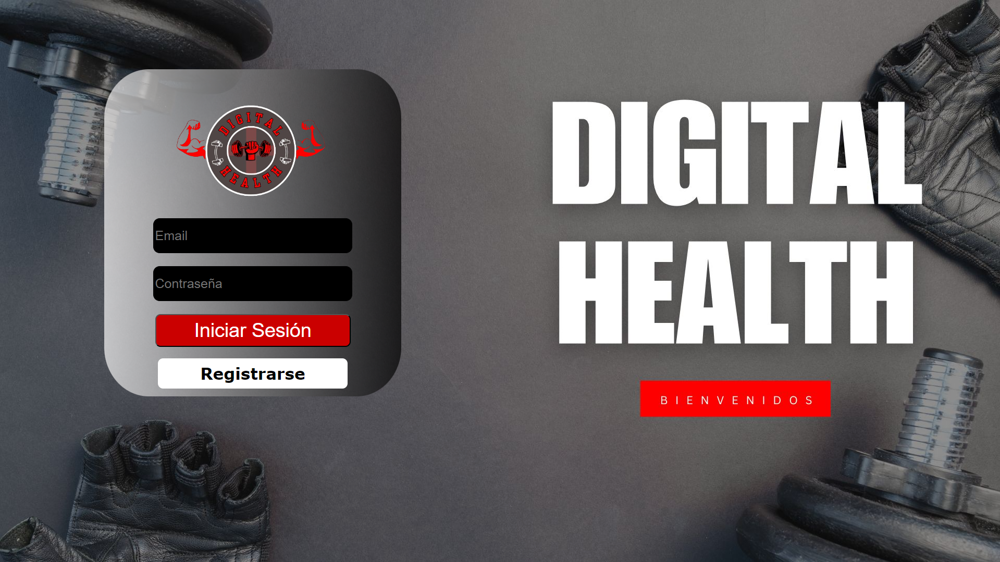

# Instrucciones

**1)**
Antes de comenzar debemos instalar el ejecutable de "Ollama" desde la pagina oficial: [Instalar Ollama](https://ollama.com/download).

**2)**
Una vez finalizada la instalacion procedemos a abrir la consola de PowerShell con el siguiente comando: `Win + R` y luego escribe `CMD`.

**3)**
En la terminal escribe el siguiente comando `ollama run llama3.1:latest` y asi crearemos el modelo que requiere el programa. Luego corremos el ejecutable que instalamos previamente, si tienes dudas cual es, ten en cuenta que su icono es una llama.

**4)**
Por ultimo, abrimos y corremos el modulo app.py que se encuentra en `GYM/view/app.py` y entramos al link mostrado por consola --> [Programa Ejecutado](http://127.0.0.1:5000)

# Definición del problema

En la actualidad, la necesidad de llevar un control preciso de las actividades físicas, rutinas de ejercicio y el monitoreo de la salud personal ha aumentado considerablemente entre quienes buscan mejorar su bienestar. No obstante, gestionar manualmente estos datos o tenerlos dispersos puede resultar ineficiente y confuso. Asimismo, la ausencia de recordatorios y un seguimiento continuo puede provocar inconsistencias en las rutinas y descuidar aspectos clave de la salud.

El presente proyecto tiene como objetivo desarrollar una aplicación que permita a los usuarios gestionar de manera eficaz sus rutinas de ejercicio y monitorear su estado de salud mediante el registro de datos clave como el peso y la altura. La aplicación ofrecerá herramientas para calcular indicadores de salud como el **Índice de Masa Corporal (IMC)**, la **Tasa Metabólica Basal (TMB)** y la **Frecuencia Cardíaca Máxima (FCM)**, proporcionando un monitoreo continuo y automatizado del bienestar físico. Además, la inclusión de recordatorios personalizados permitirá un seguimiento organizado y preciso, mejorando el cumplimiento de las rutinas y promoviendo un estado de bienestar general.

## Funcionalidad de la Aplicación

### Gestión de Ejercicios y Rutinas

La aplicación permitirá a los usuarios crear, modificar y eliminar rutinas de ejercicio de forma intuitiva. Los usuarios podrán registrar detalladamente cada rutina, incluyendo los tipos de ejercicios, repeticiones, series y tiempos de descanso, con el objetivo de proporcionar un seguimiento preciso y organizado de las actividades físicas. Además, se incluirá la funcionalidad para marcar la finalización de los ejercicios y recibir recomendaciones basadas en el historial de actividad, con el fin de fomentar una rutina de ejercicio consistente y efectiva.

### Notificaciones

La clase **Notificaciones** permite a los usuarios programar alertas personalizadas para realizar actividades relacionadas con su salud y bienestar físico, como rutinas de ejercicio o recordatorios de descanso. También gestiona notificaciones sobre eventos importantes, como actualizaciones de progreso o hitos alcanzados en sus objetivos de bienestar. Estas notificaciones ayudan a mantener un seguimiento organizado y continuo del estado físico del usuario, promoviendo hábitos saludables a través de recordatorios programados.

### Cálculo de estadísticas

El cálculo de estadísticas en la aplicación ofrece a los usuarios métricas personalizadas para monitorear su salud y rendimiento físico. Entre las principales estadísticas se incluyen el **Índice de Masa Corporal (IMC)**, que evalúa la relación entre peso y altura; la **Tasa Metabólica Basal (TMB)**, que estima las calorías necesarias para funciones vitales en reposo; y la **Frecuencia Cardíaca Máxima (FCM)**, que determina las zonas óptimas de entrenamiento cardiovascular. Estas herramientas permiten un seguimiento preciso del estado físico y la optimización de los planes de ejercicio.

### Asistente virtual

El asistente virtual, utilizando la inteligencia artificial **Ollama**, proporcionará un soporte interactivo y personalizado dentro de la aplicación. Este asistente responderá a las preguntas de los usuarios, orientándolos en el uso de las diversas funcionalidades de la plataforma. Además, ofrecerá recomendaciones adaptadas a cada usuario, basadas en el análisis de sus datos. El asistente actuará como el punto central de interacción entre el usuario y la aplicación, mejorando significativamente la experiencia general de uso al facilitar un acceso coherente y fluido a todas las herramientas y recursos disponibles.

## Arquitectura del sistema

### Interfaz de Usuario

La interfaz de usuario de la aplicación de gimnasia se diseñará para ofrecer una experiencia intuitiva y eficiente. Facilitará el acceso rápido y sencillo a las diversas funcionalidades del programa y estará equipada con un sistema de notificaciones que informará a los usuarios sobre eventos y actualizaciones importantes. Esta estructura busca garantizar una interacción fluida y un seguimiento eficaz del bienestar físico.

### Base de Datos

La implementación de la base de datos en el sistema de gestión de un gimnasio utiliza **Python** y **MySQL** para manejar de forma segura y eficiente la información de los usuarios. La clase **Database** se encarga de gestionar la conexión con MySQL, con métodos para conectar y cerrar la conexión de manera segura. La clase **Usuario** gestiona datos personales como nombre, edad y correo electrónico, y trabaja junto con Database para almacenar y consultar la información de los usuarios. En conjunto, estas clases facilitan un acceso seguro y eficiente a los datos y permiten expandir funcionalidades relacionadas con el bienestar y las rutinas de ejercicio.

## Análisis del problema

### Identificación de entidades y características

#### Clase Usuario
- **id_persona (opcional):** Identificador único del usuario.
- **nombre:** Nombre del usuario.
- **edad:** Edad del usuario.
- **email:** Correo electrónico del usuario.
- **contraseña:** Contraseña del usuario.
- **genero:** Género del usuario.

#### Clase Rutinas
- **list_ejercicios:** Lista de ejercicios incluidos en la rutina.
- **nombre_rutina:** Nombre de la rutina.
- **frecuencia_semana:** Frecuencia de la rutina en una semana.

#### Clase Ejercicio
- **tipo:** Tipo de ejercicio (por ejemplo, cardio, fuerza).
- **repeticiones_por_serie:** Número de repeticiones en cada serie.
- **series:** Número total de series.
- **descanso_entre_series:** Tiempo de descanso entre series.
- **id_ejercicio:** Identificador único del ejercicio.

#### Clase Notificación
- **tipo:** Tipo de notificación (por ejemplo, alerta, recordatorio).
- **mensaje:** Contenido del mensaje de notificación.
- **fecha_hora:** Fecha y hora en que se envía la notificación.

#### Clase Estadística
- **imc:** Índice de Masa Corporal calculado.
- **tmb:** Tasa Metabólica Basal calculada.
- **fcm:** Frecuencia Cardíaca Máxima calculada.

#### Clase Chat_Ollama
- **mensaje:** Almacena la pregunta para la IA.

### Modelo de clases

[Link de draw.io](https://acortar.link/HoLAOe)

### Casos de uso

#### Nombre: Registrar el usuario
- **Resumen:** El sistema permite al usuario registrarse y guardar su información en la base de datos.
- **Entradas:**
  - nombre
  - persona
  - edad
  - email
  - contraseña
  - genero
- **Resultado:**
  1. El sistema muestra un mensaje dando la bienvenida al sistema.
  2. El sistema pregunta al usuario la información personal.
  3. El sistema toma la información y la lleva a la base de datos.
  4. El sistema muestra un mensaje diciendo que el usuario se registró exitosamente.

- **Descomposición**
  - Pasos: Métodos: Responsable
  - **Registrar usuario:** `__init__(self, nombre: str, edad: int, email: str, contraseña: str, genero: str, id_persona: str = None)` - **Usuario**
  - **Pedir los datos al usuario y los envía a la base de datos:** `def registrar_usuario(db)` - **Database**

#### Nombre: Iniciar sesión
- **Resumen:** El sistema permite al usuario iniciar sesión luego del registro.
- **Entrada:**
  - email
  - contraseña
- **Resultado:**
  1. El sistema pide al usuario sus datos de sesión.
  2. El sistema verifica que las credenciales coinciden con el registro.
  3. Se dirige a la interfaz.

- **Descomposición**
  - Pasos: Métodos: Responsable
  - **Solicitar datos de sesión al usuario:** `def iniciar_sesion(db)` - **Usuario**
  - **Verificar que las credenciales sean iguales a las del registro:** `def verificar_credenciales(self, email, contraseña)` - **Database**

  
  ---

#### Nombre: Crear rutina y editar rutina
- **Resumen:** El sistema tiene una función donde el usuario puede crear rutinas con los ejercicios de la aplicación, además luego de creadas puede editarlas.
- **Entradas:**
  - list_ejercicios
  - nombre_rutina
  - frecuencia_semana
- **Resultado:**
  1. El sistema pregunta el nombre que desea ponerle a la rutina.
  2. El sistema toma los ejercicios que ya tiene almacenados y el usuario desea para añadirlos en la rutina.
  3. La rutina se puede editar en cualquier momento (eliminar o añadir un ejercicio).

- **Descomposición**
  - Pasos: Métodos: Responsable
  - **Crear rutina:** `__init__(self, list_ejercicios: list, nombre_rutina: str, frecuencia_semana: int)` - **Rutinas**
  - **Coleccionar los ejercicios disponibles:** `ejercicios_disponibles()` - **Rutinas**
  - **Solicitar ejercicio para la rutina:** `seleccionar_ejercicios()` - **Ejercicio**
  - **Editar rutina:** `editar_rutina()` - **Rutinas**
  - **Eliminar rutina:** `eliminar_rutina()` - **Rutinas**

  
  ---

#### Nombre: Agregar y editar ejercicios
- **Resumen:** El sistema permite al usuario ingresar sus propios ejercicios, asignándoles un nombre, una descripción y el músculo que va a trabajar, así como también editar los ejercicios almacenados.
- **Entradas:**
  - tipo
  - repeticiones
  - series
  - descanso
  - id_ejercicio
- **Resultado:**
  1. El sistema pregunta el nombre del ejercicio para que el usuario lo ingrese.
  2. El sistema pide una descripción y el músculo que va a trabajar para que lo ingrese el usuario.
  3. El sistema permite editar la descripción del ejercicio en cualquier momento.

- **Descomposición**
  - Pasos: Métodos: Responsable
  - **Crear ejercicio:** `__init__(self, tipo: str, repeticiones_por_serie: int, series: int, descanso_entre_series: int, id_ejercicio: int)` - **Ejercicio**
  - **Editar ejercicio:** `editar_ejercicio()` - **Ejercicio**

  
---
  ### Enviar notificaciones al usuario
- **Resumen**: El sistema enviará notificaciones al usuario de forma programada sobre la realización de diversas tareas.
- **Entrada**:
  - tipo
  - mensaje
  - fecha_hora
- **Resultado**:
  1. El sistema solicita el cuerpo de la notificación y la hora.
  2. El sistema crea la notificación con los datos proporcionados.
  3. El sistema envía la notificación según la programación.

- **Descomposición**
  - Pasos: Métodos: Responsable
  - **Solicitar el cuerpo de la notificación y la hora:** `solicitar_datos_notificacion()` - **Notificación**
  - **Crear la notificación con los datos proporcionados:** `__init__(self, tipo: str, mensaje: str, fecha_hora: datetime)` - **Notificación**
  - **Almacenar la notificación en la lista de notificaciones del usuario:** `agregar_notificacion_a_lista(notificacion: Notificacion)` - **Usuario**
  - **Enviar la notificación según la programación:** `enviar_notificacion(notificacion: Notificacion)` - **Notificación**

---

Nombre: Calcular estadísticas del usuario
- **Resumen**: El sistema calcula los siguientes datos del usuario: IMC (mostrando en qué categoría de bienestar está el usuario), TMB, FCM.
- **Entrada**:
  - género
  - edad
  - peso
  - altura
- **Resultado**:
  1. El sistema revisa los datos del usuario.
  2. Calcula las estadísticas en base a los datos del usuario.
  3. Los resultados se guardan.

- **Descomposición**
  - Pasos: Métodos: Responsable
  - **Recibe datos del usuario:** `recibir_datos(peso, altura)` - **Usuario**
  - **Calcular el IMC:** `calcular_imc(peso: float, altura: float)` - **Estadística**
  - **Calcular el TMB:** `calcular_tmb(género: str, edad: int, peso: float, altura: float)` - **Estadística**
  - **Calcular el FCM:** `calcular_fcm(edad: int)` - **Estadística**
  - **Guardar estadísticas:** `guardar_estadisticas()` - **Estadística**

  

---

Nombre: Hablar con Meta IA
- **Resumen**: El sistema permite que el usuario pueda estar en contacto con una Inteligencia Artificial.
- **Entradas**:
  - mensaje
- **Resultado**:
  1. El sistema recibe la pregunta.
  2. El sistema se asegura de que se pueda dar respuesta a la pregunta.
  3. Si la pregunta pasa el filtro ético, se da la respuesta.

- **Descomposición**
  - Pasos: Métodos: Responsable
  - **Ingresar pregunta a la IA:** `chat()` - **Usuario**

  

## Conclusión

En conclusión, la aplicación permitirá a los usuarios llevar un control eficiente y preciso de sus actividades físicas, rutinas de ejercicio y bienestar general. A través de la gestión de ejercicios personalizados, recordatorios automáticos y el cálculo de métricas de salud, la aplicación facilitará el cumplimiento de los objetivos de bienestar físico y promoverá hábitos saludables. El uso de tecnología de inteligencia artificial para ofrecer recomendaciones personalizadas y la integración de notificaciones automáticas hacen de esta solución una herramienta integral para mejorar la calidad de vida de sus usuarios.
